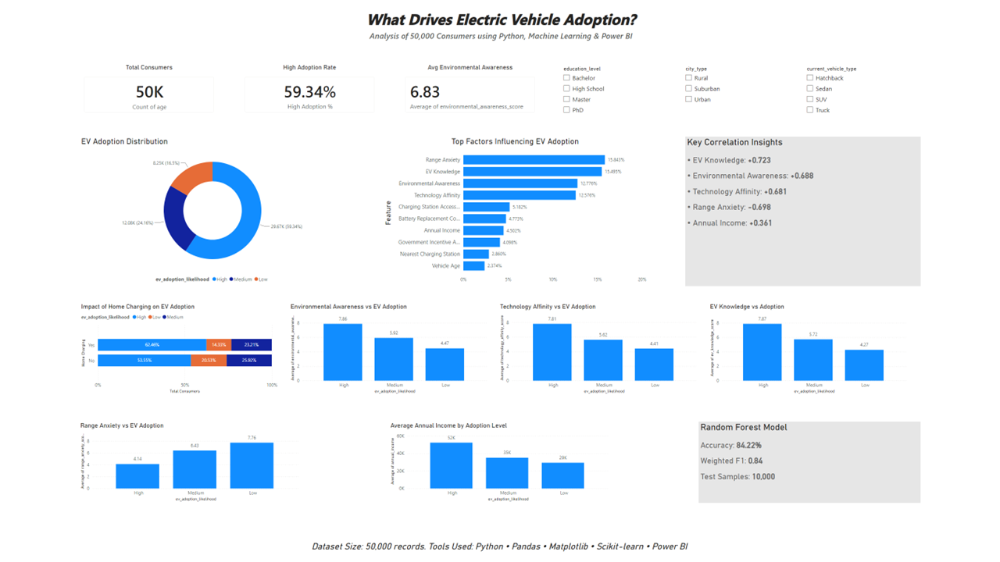

# 🚗 What Drives Electric Vehicle Adoption?

### Analysis of 50,000 Consumers using Python, Machine Learning & Power BI

This project explores the major factors influencing Electric Vehicle (EV) adoption by analyzing a dataset of **50,000 consumers**. Using Python for data analysis and machine learning, followed by Power BI for dashboard creation, the project uncovers key behavioral, economic, and technological drivers behind EV adoption.

---

## 📊 Dashboard Preview



---

# 🎯 Project Objectives

- Analyze consumer characteristics influencing EV adoption.
- Identify the strongest predictors of EV adoption.
- Build a Machine Learning model to predict adoption likelihood.
- Visualize business insights through an interactive Power BI dashboard.

---

# 📂 Dataset

- **Records:** 50,000
- **Target Variable:** `ev_adoption_likelihood`
    - High
    - Medium
    - Low

The dataset includes demographic, financial, behavioral, infrastructure, and technology-related attributes such as:

- Age
- Annual Income
- Education Level
- City Type
- Vehicle Type
- Environmental Awareness
- EV Knowledge
- Technology Affinity
- Range Anxiety
- Charging Station Accessibility
- Home Charging Availability
- Government Incentive Awareness
- Battery Replacement Concern
- Daily Commute Distance
- Monthly Fuel Expense
- Electricity Cost
- Vehicle Age

---

# 🛠 Tools & Technologies

- Python
- Pandas
- NumPy
- Matplotlib
- Seaborn
- Scikit-learn
- Jupyter Notebook
- Power BI

---

# 📈 Exploratory Data Analysis

The project includes:

- Data Cleaning
- Missing Value Handling
- Feature Engineering
- Correlation Analysis
- Consumer Segment Analysis
- Adoption Distribution Analysis
- Infrastructure Impact Analysis
- Income Analysis
- Awareness & Technology Analysis

---

# 🤖 Machine Learning

### Model Used

Random Forest Classifier

### Performance

| Metric | Score |
|--------|-------|
| Accuracy | **84.22%** |
| Weighted F1 Score | **0.84** |
| Test Samples | **10,000** |

---

# 🔍 Key Insights

### Strong Positive Correlations

| Factor | Correlation |
|---------|------------|
| EV Knowledge | **+0.723** |
| Environmental Awareness | **+0.688** |
| Technology Affinity | **+0.681** |
| Annual Income | **+0.361** |

---

### Strong Negative Correlation

| Factor | Correlation |
|---------|------------|
| Range Anxiety | **-0.698** |

---

### Top Feature Importance (Random Forest)

| Feature | Importance |
|---------|-----------|
| Range Anxiety | **15.84%** |
| EV Knowledge | **15.49%** |
| Environmental Awareness | **12.78%** |
| Technology Affinity | **12.58%** |
| Charging Station Accessibility | **5.18%** |

---

### Home Charging Impact

Consumers with home charging availability showed a noticeably higher proportion of **High EV Adoption**, highlighting the importance of charging infrastructure in consumer decision-making.

---

# 📊 Power BI Dashboard

The interactive dashboard includes:

- KPI Cards
- EV Adoption Distribution
- Feature Importance Ranking
- Correlation Insights
- Home Charging Analysis
- Environmental Awareness Analysis
- Technology Affinity Analysis
- EV Knowledge Analysis
- Income Comparison
- Range Anxiety Comparison
- Model Performance Summary
- Interactive Filters

---

# 📁 Repository Structure

```
ev-adoption-analysis/
│
├── EV_Notebook.ipynb
├── EV_Notebook.html
├── EV_Report.pbix
├── ev_dataset.csv
├── EV_Report.png
└── README.md
```

---

# 📌 Future Improvements

- Hyperparameter tuning for improved model performance
- Additional ML model comparisons (XGBoost, LightGBM)
- SHAP explainability analysis
- Deployment using Streamlit
- Live dashboard connected to SQL database

---

# 👨‍💻 Author

**Srinjoy Chatterjee**

If you found this project interesting, feel free to ⭐ the repository or connect with me on LinkedIn!

---
